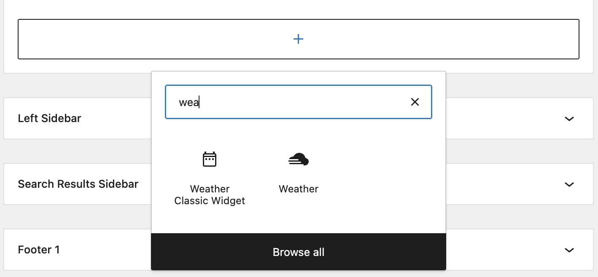

# Weather Information Plugin

### Installation

clone the repo and run following commands

```
composer install
```

```
pnpm install
```

```
pnpm build
```

### Features

- ShortCode: `nirab-wi` for display weather data.
- Widgets:

  - Weather Classic widget: for legacy old theme
  - Weather: Block supported widget
    

- **Settings**: You'll find weather settings under
  Settings menu.
  

### Test the plugin

Couple of plugins i recommend for test this plugin's feature

- [WP SMTP Mailer - SMTP7](https://wordpress.org/plugins/wp-mail-smtp-mailer/) - For Mail setup.
- [Advanced Cron Manager](https://wordpress.org/plugins/advanced-cron-manager/) - Run cron jobs instantly.

### Weather API

I use this weather API:
https://www.visualcrossing.com/

**API Key** included within config file.

### Challenges

- Twig template
  - Not supporting wordpress built-in functions. So, I'm using `php` templates.
  - Twig template cache issue on development time. [#1](https://github.com/WPDrill/core/issues/1)
- **Limitation**: Block development support didn't included!
- No proper well written documentation. So, I've to read the internal code.
